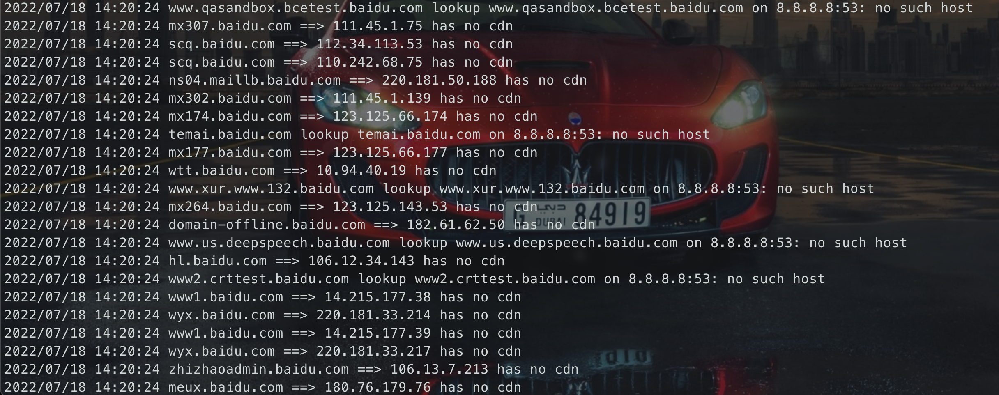

## 介绍

使用`github.com/projectdiscovery/cdncheck`、`ASN`、`CIDR`、`CNAME`来快速批量判断目标是否存在CDN，并可保存不存在CDN的域名和IP。

## 安装编译

> **重要：**
>
> 需要下载 [`GeoLite2-ASN.mmdb`](https://github.com/damit5/cdnCheck_go/raw/main/GeoLite2-ASN.mmdb) 放到执行目录下，`cdnCheck_go`会自动从运行目录读取该mmdb文件

### 最简单

前往[release页面](https://github.com/damit5/cdnCheck_go/releases)下载对应版本

### 自动

```shell
go install github.com/damit5/cdnCheck_go@latest
```


### 手动

```shell
git clone https://github.com/damit5/cdnCheck_go
cd cdnCheck_go
goreleaser build
```

## 用法

```shell
Usage of ./cdnCheck_darwin:
  -nd string
    	无CDN域名保存地址，不保存置空即可
  -ni string
    	无CDN IP保存地址，不保存置空即可
  -t string
    	需要扫描的文件
  -thread int
    	并发数 (default 20)
    	
./cdnCheck_darwin -t ../test/baidu.com.txt -thread 100 -nd ../test/nocdndomain.txt -ni ../test/nocdnip.txt
```



## 疑难杂症

* 建议修改本地NS Server的地址为`8.8.8.8`或者其他大DNS，不然可能因为并发太大导致结果很多请求被拒绝